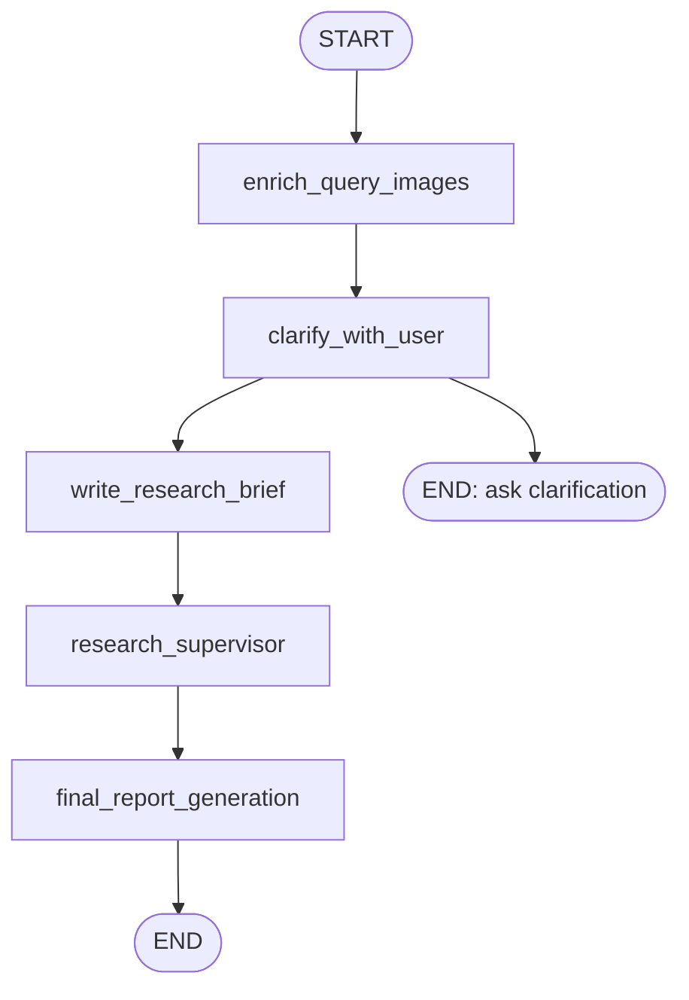
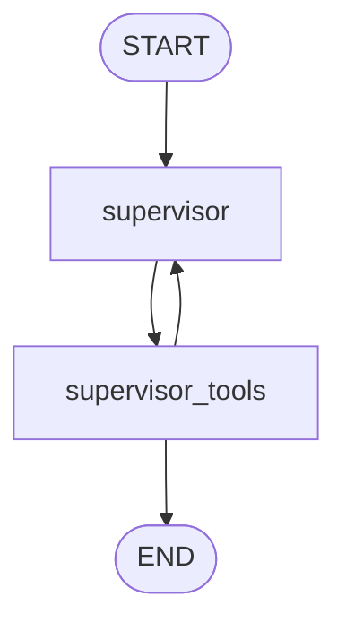
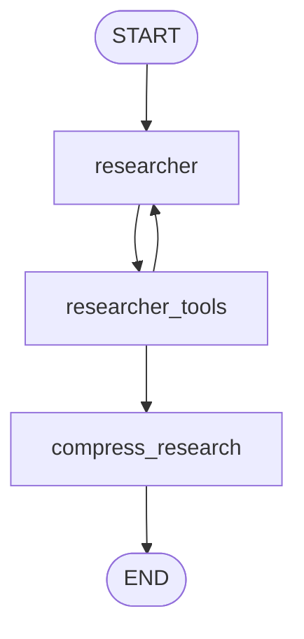

# Agent Loop 模块说明

## 本页速览

| 项目     | 内容                                                                             |
| -------- | -------------------------------------------------------------------------------- |
| 阅读目标 | 理解 deep research 主流程如何把用户请求变成研究 brief、并行子研究和最终报告。    |
| 关键代码 | `src/open_deep_research/deep_researcher.py`、`state.py`、`utils.py`、`budget.py` |
| 上游文档 | [当前技术栈说明](technical-stack.md)                                             |
| 下游文档 | [Tools 模块说明](tools.md)、[RAG 模块说明](rag.md)、[Memory 模块说明](memory.md) |

建议先看第 2 节的三层 graph，再按 main graph、supervisor loop、researcher loop 的顺序阅读。若只排查预算或工具行为，可直接跳到第 8 节和第 7 节。

## 1. 模块定位

Agent loop 是 Open Deep Research 的主执行流程，负责把用户输入转成研究任务、调度子研究员、执行工具调用、压缩研究结果、生成最终报告，并可选写入 memory。

核心文件：

- `src/open_deep_research/deep_researcher.py`
- `src/open_deep_research/state.py`
- `src/open_deep_research/prompts.py`
- `src/open_deep_research/utils.py`
- `src/open_deep_research/budget.py`

主导技术：

- LangGraph `StateGraph`
- LangChain chat model
- LangChain tool calling
- `Command(goto=..., update=...)` 路由

## 2. 三层 Graph 结构

项目当前有三层 graph：

1. Main graph：完整 deep research 流程。
2. Supervisor subgraph：规划和分派研究任务。
3. Researcher subgraph：执行具体检索任务并压缩结果。

整体结构：



Supervisor subgraph：



Researcher subgraph：



## 3. State 定义

位置：

- `src/open_deep_research/state.py`

### 3.1 `AgentState`

主 graph 状态：

| 字段                  | 含义                |
| --------------------- | ------------------- |
| `messages`            | 用户和 AI 消息      |
| `supervisor_messages` | supervisor 内部消息 |
| `research_brief`      | 研究简报            |
| `raw_notes`           | 原始研究笔记        |
| `notes`               | 压缩后的研究结果    |
| `budget_usage`        | 预算使用情况        |
| `final_report`        | 最终报告            |

### 3.2 `SupervisorState`

Supervisor subgraph 状态：

| 字段                  | 含义                      |
| --------------------- | ------------------------- |
| `supervisor_messages` | supervisor 对话和工具消息 |
| `research_brief`      | 研究任务                  |
| `notes`               | 子研究员返回的压缩结果    |
| `research_iterations` | supervisor 迭代次数       |
| `raw_notes`           | 子研究员原始工具输出      |
| `budget_usage`        | 预算使用情况              |

### 3.3 `ResearcherState`

Researcher subgraph 状态：

| 字段                   | 含义                      |
| ---------------------- | ------------------------- |
| `researcher_messages`  | researcher 对话和工具消息 |
| `tool_call_iterations` | researcher 工具调用轮数   |
| `research_topic`       | 子研究主题                |
| `compressed_research`  | 压缩后的结果              |
| `raw_notes`            | 原始工具输出              |
| `budget_usage`         | 预算使用情况              |

## 4. Reducer 规则

### 4.1 `override_reducer`

默认把 list 追加。

如果新值是：

```python
{"type": "override", "value": ...}
```

则直接覆盖旧值。

用途：

- 清理 `notes`。
- 初始化 `supervisor_messages`。
- 覆盖 raw notes。

### 4.2 `budget_usage_reducer`

通过 `merge_budget_usage(...)` 累加预算。

如果传入 override，则重置为指定值。

## 5. Main Graph 节点

### 5.1 `enrich_query_images`

职责：

- 在研究规划前识别用户问题中附带的图片。
- 识别结果作为临时 query context 注入 `messages`。
- 不写入本地知识库或 memory。

启用条件：

- `rag_query_image_enabled=True`
- `rag_multimodal_enabled=True`

图片来源：

- message content 中的 image URL / base64 / file path。

输出：

- 一条带 `additional_kwargs={"rag_query_image_context": True}` 的 `HumanMessage`。

后续写 memory 时会通过 `_messages_without_query_image_context(...)` 排除这类临时图片上下文。

### 5.2 `clarify_with_user`

职责：

- 判断用户请求是否需要澄清。
- 如果需要，直接结束本轮 graph 并返回澄清问题。
- 如果不需要，生成确认消息并进入 `write_research_brief`。

结构化输出：

```python
class ClarifyWithUser(BaseModel):
    need_clarification: bool
    question: str
    verification: str
```

跳过条件：

- `allow_clarification=False`
- Budget Guard 判断需要保留最终报告模型调用

### 5.3 `write_research_brief`

职责：

- 把用户消息转换成更具体的研究简报。
- 初始化 supervisor prompt。

结构化输出：

```python
class ResearchQuestion(BaseModel):
    research_brief: str
```

输出到 state：

- `research_brief`
- 覆盖式 `supervisor_messages`

如果预算不足，会直接用原始消息文本作为 brief。

### 5.4 `research_supervisor`

这是 supervisor subgraph，不是单个普通函数。

输入：

- `research_brief`
- `supervisor_messages`
- `budget_usage`

输出：

- `notes`
- `raw_notes`
- `budget_usage`

### 5.5 `final_report_generation`

职责：

- 汇总 `notes`。
- 根据 `research_brief`、原始消息和 findings 生成最终报告。
- 处理 token limit retry。
- 追加预算摘要。
- 可选写入 MySQL memory。
- 清空 `notes`。

失败策略：

- 如果没有模型调用预算，返回 findings fallback。
- 如果输出 token 预算耗尽且开启 final report reserve，会生成紧凑报告。
- 如果 token limit 超出，会逐步截断 findings 后重试。
- 非 token 错误会返回错误文本。

## 6. Supervisor Loop

### 6.1 `supervisor`

职责：

- 使用 research model 规划研究。
- 绑定工具：
  - `ConductResearch`
  - `ResearchComplete`
  - `think_tool`
- 生成 tool calls。

输出：

- 追加 AI message。
- `research_iterations + 1`。

### 6.2 `supervisor_tools`

职责：

- 执行 supervisor 发出的工具调用。
- 处理 reflection。
- 并行启动 researcher subgraph。
- 汇总 researcher 输出。
- 判断是否结束 supervisor loop。

退出条件：

- `research_iterations > max_researcher_iterations`
- 最近 AI message 没有 tool calls
- 调用了 `ResearchComplete`
- 预算已达上限
- 研究任务全部因预算或并发限制无法执行

### 6.3 `ConductResearch`

结构化工具：

```python
class ConductResearch(BaseModel):
    research_topic: str
```

每个 `ConductResearch` 会启动一个 researcher subgraph：

```python
researcher_subgraph.ainvoke({
    "researcher_messages": [HumanMessage(content=research_topic)],
    "research_topic": research_topic,
    "budget_usage": projected_usage,
}, config)
```

多个 researcher 会通过 `asyncio.gather` 并行执行。

并发上限：

- `max_concurrent_research_units`

## 7. Researcher Loop

### 7.1 `researcher`

职责：

- 根据当前子研究主题调用工具。
- 加载当前配置下所有可用工具：
  - `ResearchComplete`
  - `think_tool`
  - web search
  - RAG search
  - MCP tools
- 生成 tool calls。

如果没有任何外部研究工具，会抛出错误。

外部研究工具是指除 `ResearchComplete` 和 `think_tool` 之外的工具。

### 7.2 `researcher_tools`

职责：

- 执行 researcher 发出的工具调用。
- 并行运行允许执行的工具。
- 将结果包装成 `ToolMessage`。
- 判断继续检索还是进入压缩。

早退条件：

- 最近 AI message 没有 tool calls。
- 没有 native web search。
- 预算已经用完。

晚退条件：

- `tool_call_iterations >= max_react_tool_calls`
- 调用了 `ResearchComplete`
- 工具执行后预算到达上限

### 7.3 `execute_tool_safely`

职责：

- 统一执行工具。
- 捕获异常，返回错误文本。
- 捕获工具内部产生的 budget usage。

返回：

```python
(observation, captured_budget)
```

### 7.4 `compress_research`

职责：

- 把 researcher 的工具输出和 AI 消息压缩成结构化研究摘要。
- 保留来源和关键事实。
- 输出 `compressed_research` 和 `raw_notes`。

失败策略：

- 预算不足时直接拼接 raw notes。
- token limit 时移除较早消息后重试。
- 最多重试 3 次。

## 8. Budget Guard

Agent loop 在多个阶段检查预算：

- 澄清前
- 生成 research brief 前
- supervisor 规划前
- supervisor 工具执行前
- 启动 researcher 前
- researcher 推理前
- researcher 工具执行前后
- 压缩前
- 最终报告前

预算类型：

- 模型调用次数
- 工具调用次数
- 搜索调用次数
- 输入 token
- 输出 token

关键策略：

- 默认保留一次最终报告模型调用。
- 超预算工具会被替换为 synthetic ToolMessage。
- findings 过长时会截断以适配剩余 input token。
- 最终报告会追加预算摘要。

## 9. Memory 写入集成

位置：

- `maybe_persist_chat_memory(...)`

调用时机：

- `final_report_generation(...)` 成功生成最终报告后。

写入内容：

- 用户和 AI 消息文本，不包括 query image 临时上下文。
- 最终报告作为 summary。
- `research_brief` 作为一个默认 project fact。
- metadata：

```python
{
    "workflow": "deep_researcher",
    "date": get_today_str(),
}
```

启用条件：

- `rag_memory_write_enabled=True`

## 10. 错误处理策略

Agent loop 的总体设计是“局部失败，流程尽量收束”：

- 工具异常变成工具结果文本。
- RAG search 异常变成 `Local RAG search failed: ...`。
- MCP 连接失败则不加载对应工具。
- researcher 子图异常会结束 supervisor 研究阶段。
- final report token limit 会截断 findings 并重试。
- memory 写入失败只记录 warning。

## 11. 扩展建议

### 新增主流程节点

需要考虑：

- 在 `AgentState` 增加字段。
- 在 `deep_researcher_builder` 中添加 node 和 edge。
- 明确该节点是否消耗模型预算。
- 定义失败时是结束、跳过还是 fallback。

### 新增 supervisor 工具

需要考虑：

- 是否是控制工具。
- 是否会启动子任务。
- 是否需要并发限制。
- 是否需要计入 Budget Guard。
- 是否影响 `get_notes_from_tool_calls(...)` 的最终 notes。

### 新增 researcher 工具

优先在工具装配层接入：

- `get_retrieval_tools`
- 或 `load_mcp_tools`
- 或 `get_all_tools`

并更新 `get_research_tool_prompt(...)`，让模型知道什么时候使用它。
