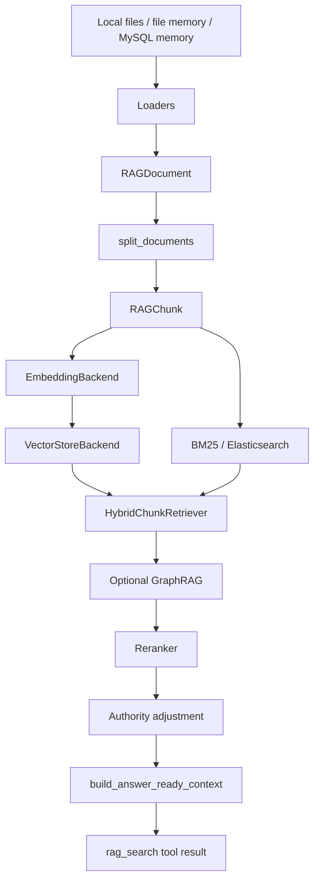

# RAG 模块说明

## 本页速览

| 项目     | 内容                                                                                          |
| -------- | --------------------------------------------------------------------------------------------- |
| 阅读目标 | 理解本地知识库和 memory 如何变成可引用的 `rag_search` 上下文。                                |
| 关键代码 | `src/open_deep_research/rag/`、`src/open_deep_research/tools/rag_tool.py`                     |
| 上游文档 | [当前技术栈说明](technical-stack.md)、[Tools 模块说明](tools.md)                              |
| 下游文档 | [Memory 模块说明](memory.md)、[RAG 检索测试记录](../evaluation/rag-retrieval-test-records.md) |

建议按顶层流程、数据结构、pipeline / indexer / loader、召回与重排、citation 的顺序阅读。若只做调参，可先看第 19 节配置速查和第 20 节常见问题。

## 1. 模块定位

`rag` 模块负责本地知识库和记忆的检索增强生成链路。它不直接生成最终回答，而是为 researcher agent 返回带引用的上下文。

核心职责：

- 加载本地文件、图片、PDF、代码文件和 memory。
- 把原始数据统一成 `RAGDocument`。
- 切分成 `RAGChunk`。
- 生成 embedding。
- 写入向量库。
- 构建关键词索引。
- 执行 hybrid retrieval、GraphRAG expansion、rerank。
- 格式化带 SOURCE 的 answer-ready context。
- 作为 agent tool 和 MCP server 对外暴露。

核心目录：

- `src/open_deep_research/rag/`

## 2. 顶层流程



查询入口是：

- `RAGPipeline.query(...)`

索引入口是：

- `RAGIndexer.ensure_ready(...)`

## 3. 数据结构

位置：

- `src/open_deep_research/rag/types.py`

### 3.1 `RAGDocument`

原始文档单元。

字段：

- `content`
- `source`
- `title`
- `metadata`

一个物理文件不一定只对应一个 `RAGDocument`：

- `.txt` / `.md` 通常是一文件一 document。
- `.json` 是一个 document，后续由 splitter 按 JSON 结构切。
- `.pdf` 按页生成多个 document。
- 图片生成一个 document。
- MySQL memory 每条可索引记录生成一个 document。

### 3.2 `RAGChunk`

可检索单元。

字段：

- `content`
- `source`
- `title`
- `chunk_id`
- `metadata`

chunk 会进入：

- embedding
- vector store
- BM25
- reranker
- citation formatter

### 3.3 `RetrievalResult`

检索候选。

包含：

- `chunk`
- `score`
- `vector_score`
- `keyword_score`
- `graph_score`
- `structured_score`
- `rerank_score`

这些分数字段用于调试一条结果是被向量、关键词、图扩展、结构化 metadata 还是 reranker 拉上来的。

### 3.4 `Citation`

面向 LLM 的引用对象。

包含：

- citation id
- title
- source
- chunk id
- excerpt
- metadata

### 3.5 `AnswerReadyContext`

`rag_search` 最终返回的结构化结果。

关键字段：

- `query`
- `context`
- `citations`
- `matched_chunks`

`context` 是会进入 `ToolMessage.content` 的文本。

## 4. Pipeline 层

位置：

- `src/open_deep_research/rag/service.py`

核心类：

- `RAGPipelineConfig`
- `RAGPipeline`

### 4.1 `RAGPipelineConfig`

集中保存 RAG 所需配置：

- 数据源路径
- chunk 参数
- top-k 参数
- embedding backend
- vectorstore backend
- keyword backend
- reranker backend
- multimodal 参数
- memory 参数
- graph 参数
- authority rerank 参数

默认后端：

- embedding：`sentence_transformers`
- embedding model：`sentence-transformers/paraphrase-multilingual-MiniLM-L12-v2`
- vector store：`milvus`
- reranker：`cross_encoder`
- reranker model：`BAAI/bge-reranker-base`
- keyword backend：`memory`

### 4.2 `RAGPipeline.query`

流程：

1. 调用 `indexer.ensure_ready()`，确保索引可用。
2. 如果没有文档或 chunk，返回无本地数据提示。
3. 对 query 生成 query vector。
4. 计算候选数量：`max(top_k, rerank_top_n)`。
5. 调用 `HybridChunkRetriever.retrieve(...)`。
6. 调用 reranker 精排。
7. 可选执行 authority adjustment。
8. 过滤低相关或被 authority 阻断的结果。
9. 调用 `build_answer_ready_context(...)`。

### 4.3 Pipeline 缓存

函数：

- `build_rag_index_id(config)`
- `get_or_create_rag_pipeline(config)`
- `reset_rag_pipeline_cache()`

`index_id` 由 `RAGPipelineConfig` 序列化后 sha256 得到。

同一配置会复用同一个进程内 pipeline，避免重复加载 embedding、vector store、reranker。

## 5. Indexer 层

位置：

- `src/open_deep_research/rag/indexer.py`

核心类：

```python
class RAGIndexer
```

职责：

- 创建 embedding backend。
- 创建 vector store backend。
- 加载所有数据源。
- 切块。
- 写向量库。
- 建关键词索引。
- 创建 hybrid retriever。
- 标记 MySQL pending memory 为 indexed。

### 5.1 `ensure_ready(force=False)`

流程：

1. 计算 source fingerprint。
2. 如果已经 ready 且 fingerprint 未变化，直接返回。
3. 加锁，避免并发重复构建。
4. 加载 indexable documents。
5. 调用 `split_documents(...)`。
6. 批量 embedding。
7. 写入 vector store。
8. 构建 BM25 或 Elasticsearch BM25。
9. 创建 `HybridChunkRetriever`。
10. 标记 pending MySQL memory 已索引。
11. 保存 fingerprint 并置 ready。

### 5.2 `source_fingerprint()`

包含：

- knowledge base 文件 fingerprint
- file memory fingerprint
- MySQL memory fingerprint

用于判断数据源是否变化，而不是用于 index 命名。

### 5.3 `index_pending_memories()`

当前实现会 `ensure_ready(force=True)`，即刷新完整索引，使本地文件和 MySQL memory 保持在同一个一致集合内。

## 6. Loader 层

位置：

- `src/open_deep_research/rag/loaders/`

### 6.1 Knowledge Loader

文件：

- `knowledge.py`

入口：

- `load_documents_from_paths(...)`
- `fingerprint_knowledge_base_paths(...)`

支持类型：

- 文本：`.txt`
- Markdown：`.md`
- JSON：`.json`
- PDF：`.pdf`
- 常见代码文件
- 图片：`.png`、`.jpg`、`.jpeg`、`.webp`、`.bmp`、`.tif`、`.tiff`

图片和扫描 PDF 页需要 `multimodal_enabled=True`。

PDF 处理：

- 通过 PyMuPDF 按页加载。
- 普通文本页直接抽文本。
- 无文本页可渲染成图片后走 OCR / Vision 路由。

图片处理：

- 先分析图像特征。
- 快速 OCR probe。
- 根据图像类型路由到 OCR、Vision、both 或 skip。
- 输出可检索文本和 route metadata。

### 6.2 File Memory Loader

文件：

- `file_memory.py`

入口：

- `load_memory_documents_from_paths(...)`
- `fingerprint_memory_paths(...)`

支持类型：

- `.json`
- `.jsonl`

支持 JSON 形态：

- 单个 record
- record 数组
- `{ "memories": [...] }`
- `{ "messages": [...] }`
- `{ "items": [...] }`
- `{ "records": [...] }`

会把 record 转成 `RAGDocument`，source 使用 `memory://...` 协议以区别本地文件。

### 6.3 MySQL Memory Loader

文件：

- `mysql_memory.py`

入口：

- `records_to_documents(...)`
- `load_memory_documents_from_mysql(...)`
- `fingerprint_mysql_memory(...)`

它读取 `memory` 模块的 `ChatMemoryRecord`，只转换允许索引的 memory types。

source 格式：

```text
memory://mysql/{conversation_id}/{memory_id}
```

### 6.4 Query Image Loader

文件：

- `query_images.py`

作用：

- 识别用户问题里附带的图片。
- 生成临时 query context。
- 不进入知识库索引。
- 不进入 memory 写入。

入口：

- `build_query_image_context(...)`

## 7. Splitter 层

位置：

- `src/open_deep_research/rag/splitter.py`

入口：

- `split_documents(documents, chunk_size, chunk_overlap)`

切分策略：

| 文件类型                      | 策略                                   |
| ----------------------------- | -------------------------------------- |
| Markdown                      | 先按 h1/h2/h3 分节，再按字符窗口切     |
| JSON                          | 解析 JSON leaf，按 parent path 分组    |
| Code                          | 使用 LangChain language-aware splitter |
| Plain text / PDF / image text | recursive character splitter           |

metadata 保留：

- source
- file type
- document index
- chunk index
- char range
- line range
- heading path
- JSON path / field paths
- PDF page
- code language
- content hash
- authority metadata

chunk id 格式：

```text
{stable_document_key}-{chunk_index}-{content_hash前12位}
```

## 8. Embedding 层

位置：

- `src/open_deep_research/rag/embeddings.py`

统一接口：

```python
class EmbeddingBackend:
    def embed_texts(self, texts: list[str]) -> list[list[float]]
    def embed_query(self, text: str) -> list[float]
```

实现：

- `SentenceTransformerEmbeddingBackend`
- `HashEmbeddingBackend`

`HashEmbeddingBackend` 是确定性 fallback，适合测试和离线诊断，不适合真实检索质量评估。

## 9. Vector Store 层

位置：

- `src/open_deep_research/rag/vectorstore.py`

统一接口：

```python
class VectorStoreBackend:
    def is_ready(self) -> bool
    def add(self, chunks, vectors) -> None
    def search(self, query_vector, top_k) -> list[RetrievalResult]
```

支持后端：

| provider | 类                    | 说明                                       |
| -------- | --------------------- | ------------------------------------------ |
| `memory` | `InMemoryVectorStore` | 测试和临时实验                             |
| `faiss`  | `FaissVectorStore`    | 本地 FAISS + chunks sidecar                |
| `chroma` | `ChromaVectorStore`   | Chroma persistent collection               |
| `milvus` | `MilvusVectorStore`   | 默认持久化后端，支持 Milvus Lite 或 server |

Milvus 本地默认 URI：

```text
data/indexes/rag/milvus.db
```

collection name 会使用：

```text
{collection_name}_{index_id前16位}
```

并做保守字符清理。

## 10. Keyword Retrieval 层

位置：

- `src/open_deep_research/rag/retriever.py`
- `src/open_deep_research/rag/elasticsearch_bm25.py`

支持：

- 内存 BM25：`BM25Index`
- Elasticsearch BM25：`ElasticsearchBM25Index`

BM25 会索引：

```text
chunk.title + chunk.content
```

tokenizer 对英文保留 word token，对 CJK 按单字拆分，提供基础中文关键词召回能力。

## 11. Hybrid Retriever

位置：

- `HybridChunkRetriever`

流程：

1. 向量库返回 dense vector results。
2. BM25 / Elasticsearch 返回 keyword results。
3. 用 Reciprocal Rank Fusion 融合排名。
4. 可选 GraphRAG expansion。
5. 结构化 metadata boost。
6. 返回 top candidates 给 reranker。

### 11.1 RRF

函数：

- `reciprocal_rank_fusion(...)`

按排名位置融合 dense 和 keyword，而不是直接相加原始分数。

好处：

- 降低不同检索后端分数尺度不一致的问题。
- 避免单一路径漏召回。

### 11.2 Structured Metadata Boost

函数：

- `apply_structured_metadata_boost(...)`

会把 source、title、file type、language、memory type、heading、json path、page 等 metadata 转成短文本。

如果 query term 命中这些 metadata，会给结果一个小幅加分。

## 12. GraphRAG Expansion

位置：

- `src/open_deep_research/rag/graph.py`

支持后端：

- `memory`
- `neo4j`

作用：

- 在 vector + BM25 找到 seed chunks 后，根据共享实体/术语扩展邻居 chunk。
- 它不替代向量召回和关键词召回，只补充相关上下文。

配置：

- `graph_enabled`
- `graph_backend`
- `graph_max_neighbors`
- `graph_weight`
- `neo4j_uri`
- `neo4j_username`
- `neo4j_password`
- `neo4j_database`

## 13. Reranker 层

位置：

- `src/open_deep_research/rag/reranker.py`

统一接口：

```python
class Reranker:
    def rerank(query, results, top_k) -> list[RetrievalResult]
```

支持：

| provider                | 类                       | 说明             |
| ----------------------- | ------------------------ | ---------------- |
| `cross_encoder` / `bge` | `CrossEncoderReranker`   | 默认生产路径     |
| `simple`                | `KeywordOverlapReranker` | 测试和低依赖环境 |
| `none` / `disabled`     | `NoOpReranker`           | 不重排           |

reranker 输入文本包含结构化 metadata 和 chunk content，便于模型利用标题、来源、JSON path 等信息判断相关性。

## 14. Authority Rerank

位置：

- `splitter.py`
- `service.py`

splitter 会推断：

- `source_status`
- `authority_weight`
- `authority_score_penalty`

可能状态：

- `authoritative`
- `deprecated`
- `misleading`
- `unanswerable_trap`

`RAGPipeline.query(...)` 在 rerank 后可选执行 `apply_authority_adjustment(...)`。

默认会：

- 下调 deprecated / misleading 结果。
- 阻断 `misleading` 和 `unanswerable_trap` 结果进入最终引用。

## 15. Citation Formatter

位置：

- `src/open_deep_research/rag/citations.py`

入口：

- `build_answer_ready_context(query, matched_chunks)`

输出格式包括：

- Local knowledge base results header
- grounding 规则
- SOURCE 块
- SOURCE path
- CHUNK ID
- METADATA
- EXCERPT
- Sources 列表

重要约束：

```text
Use only the cited excerpts below for claims about local knowledge or chat memory.
```

这样可以在 researcher、compression、final report 多阶段之后仍保留本地证据约束。

## 16. Query Rewrite

位置：

- `src/open_deep_research/rag/query_rewriter.py`

入口：

- `maybe_rewrite_query_with_model(...)`

作用：

- 把用户问题改写为单条 standalone retrieval query。
- 保留专有名词、ID、文件路径、JSON path、技术术语。
- 不回答问题。
- 失败时回退原 query。

Agent tool 中默认可启用，MCP server 中也支持通过 config 控制。

## 17. MCP Server

位置：

- `src/open_deep_research/rag/mcp_server.py`

服务名：

```text
open-deep-research-rag
```

暴露工具：

| MCP tool                     | 作用                                    |
| ---------------------------- | --------------------------------------- |
| `rag_search`                 | 执行本地 RAG 查询并返回结构化 citations |
| `rag_ensure_indexed`         | 构建或刷新索引                          |
| `rag_index_pending_memories` | 刷新索引并标记 pending MySQL memory     |
| `rag_status`                 | 查看 pipeline cache 和索引状态          |
| `rag_list_sources`           | 列出配置的数据源，不构建 embedding      |
| `rag_reset_cache`            | 清空进程内 pipeline cache               |

运行入口：

```bash
python -m open_deep_research.rag.mcp_server
```

支持 transport：

- `stdio`
- `sse`
- `streamable-http`

## 18. Agent Tool 入口

位置：

- `src/open_deep_research/tools/rag_tool.py`

`rag_search` 工具把 `Configuration` 转成 `RAGPipelineConfig`，然后调用：

```python
pipeline.query(retrieval_query, original_query=query)
```

返回的是 `answer_ready_context.context` 字符串。

## 19. 关键配置速查

| 配置                             | 作用                               |
| -------------------------------- | ---------------------------------- |
| `rag_enabled`                    | 是否启用本地 RAG                   |
| `retrieval_mode`                 | `web_only` / `rag_only` / `hybrid` |
| `rag_knowledge_base_paths`       | 本地知识库路径                     |
| `rag_top_k`                      | 最终返回 chunk 数                  |
| `rag_rerank_top_n`               | 进入 reranker 的候选数             |
| `rag_chunk_size`                 | chunk 字符长度                     |
| `rag_chunk_overlap`              | chunk 重叠长度                     |
| `rag_embedding_provider`         | embedding 后端                     |
| `rag_vectorstore_provider`       | vector store 后端                  |
| `rag_keyword_backend`            | keyword 后端                       |
| `rag_hybrid_alpha`               | dense / keyword 权重相关配置       |
| `rag_structured_metadata_weight` | metadata 命中加权                  |
| `rag_graph_enabled`              | 是否启用 GraphRAG                  |
| `rag_authority_rerank_enabled`   | 是否启用权威性降权                 |
| `rag_memory_enabled`             | 是否把 memory 纳入 RAG             |
| `rag_memory_mysql_url`           | MySQL memory URL                   |
| `rag_multimodal_enabled`         | 是否启用图片/PDF 图像页处理        |
| `rag_query_rewrite_enabled`      | 是否启用 query rewrite             |

## 20. 常见问题

### 没有加载到文档

检查：

- `rag_knowledge_base_paths` 是否存在。
- 文件扩展名是否受支持。
- 图片是否开启 `rag_multimodal_enabled`。
- PDF 是否有可抽取文本，或 OCR / Vision 依赖是否可用。

### 检索不到明显关键词

检查：

- `rag_keyword_top_k`
- `rag_keyword_backend`
- chunk 是否包含该关键词。
- source/title/metadata 是否被正确保留。

### 语义召回效果弱

检查：

- embedding provider 是否为真实语义模型。
- 是否误用了 `hash` embedding。
- chunk size 是否过大或过小。
- reranker 是否启用。

### MySQL memory 没进入索引

检查：

- `rag_memory_enabled=True`
- `rag_memory_mysql_url` 配置正确。
- `memory_conversation_id` / `memory_user_id` 是否与写入时一致。
- `record_type` 是否在 `rag_memory_mysql_index_record_types` 中。
- `index_status` 是否为 `pending` 或索引是否已刷新。

### RAG 引用结果被过滤

检查：

- `source_status`
- `authority_score_penalty`
- `rag_authority_rerank_enabled`

`misleading` 和 `unanswerable_trap` 会被阻断。
