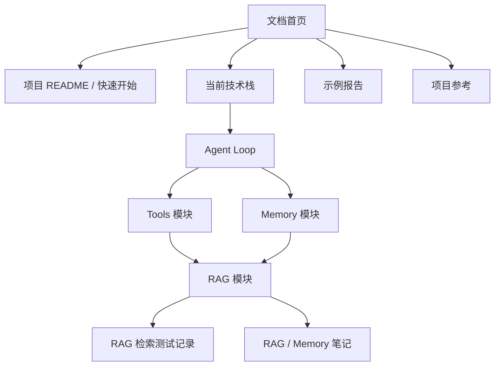

# Open Deep Research 文档站

这里汇总 Open Deep Research 当前实现的使用说明、架构文档、RAG / Memory 设计、评估记录、示例报告和项目维护说明。

::: tip 阅读建议
第一次接手项目时，建议按“快速开始 -> 当前技术栈 -> Agent Loop -> Tools -> RAG -> Memory”的顺序阅读；排查检索质量时直接进入评估记录。
:::

::: warning 内容边界
根目录、examples、legacy、data/knowledge 中已有的 Markdown 已复制进文档站对应主题目录。原文件仍保留在原位置，避免影响项目入口、示例数据和历史实现。
:::

## 推荐阅读路径

1. 阅读 [项目 README](./guide/project-readme.md)，完成环境准备和基础运行。
2. 阅读 [当前技术栈](./architecture/technical-stack.md)，理解当前默认链路、可选后端和关键依赖。
3. 阅读 [Agent Loop](./architecture/agent-loop.md)，掌握主流程如何调度 supervisor、researcher、tools 和 final report。
4. 阅读 [Tools 模块](./architecture/tools.md)，确认 web search、RAG、MCP 和控制工具如何装配。
5. 阅读 [RAG 模块](./architecture/rag.md)，深入本地知识库、memory、hybrid retrieval、reranker 和 citation 链路。
6. 阅读 [Memory 模块](./architecture/memory.md)，理解 MySQL memory 的写入、索引和回查边界。
7. 阅读 [RAG 检索测试记录](./evaluation/rag-retrieval-test-records.md)，复现或比较检索效果。

## 文档地图

## 主题入口

| 主题         | 入口                                                           | 说明                                   |
| ------------ | -------------------------------------------------------------- | -------------------------------------- |
| 快速开始     | [项目 README](./guide/project-readme.md)                       | 项目介绍、安装、运行和配置说明         |
| 架构与模块   | [当前技术栈](./architecture/technical-stack.md)                | 当前实现的技术分层、默认栈和模块边界   |
| RAG / Memory | [RAG 模块](./architecture/rag.md)                              | 本地知识库、长期记忆、检索、重排和引用 |
| 评估         | [RAG 检索测试记录](./evaluation/rag-retrieval-test-records.md) | 历次检索指标、配置、未命中样本和说明   |
| 示例         | [ArXiv 示例](./examples/arxiv.md)                              | 示例研究报告和输出样本                 |
| 知识库       | [Team Handbook](./knowledge/team-handbook.md)                  | 本地知识库样例文档                     |
| 项目参考     | [Agent Instructions](./project/agents.md)                      | 根目录维护说明和 agent 指令副本        |
| Legacy       | [Legacy Overview](./legacy/legacy.md)                          | 旧版实现和历史说明                     |

## 维护约定

- 模块说明优先记录当前实现；过时背景放到 legacy 或评估记录。
- 新增模块文档建议按“定位 -> 流程 -> 数据结构 / 配置 -> 错误处理 -> 扩展建议”的顺序维护。
- 评估记录采用追加式写法，保留命令、配置、指标、未命中样本和解释。
- VitePress 导航变更时同步更新 `docs/.vitepress/config.mts`。
